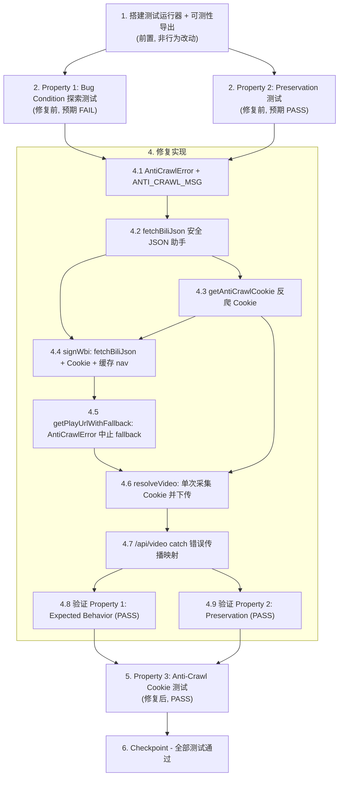

# Implementation Plan

## Overview

本任务列表遵循 Bug Condition 修复方法论。先在**未修复**代码上写测试以重现并理解 bug（暴露反例），再在保留既有行为的前提下应用修复。

- **Bug Condition (C)**：视频解析链路中任一上游接口（`nav` / `playurl` / `view`）返回反爬响应（状态码非 2xx、`Content-Type` 非 JSON / HTML 风控页、或 `code === -352`）。
- **Property (P)**：修复后不抛出 / 不返回包含 `Unexpected token` 或 `is not valid JSON` 的消息，而是返回 `status:"error"` + 可读中文反爬提示。
- **Preservation（¬C）**：未触发风控的输入（正常视频、直播、无效 BV、`ERROR_MAP` 业务码、缓存命中、`/proxy`）行为与修复前逐字段一致。
- **F / F'**：`resolveVideo`（修复前）/ `resolveVideo'`（修复后）。

## Tasks

- [x] 1. 搭建测试运行器与可测性改造（前置准备，非行为改动）
  - 在仓库根目录新增 `package.json`（`"type": "module"`），添加 devDependencies：`vitest`、`fast-check`，并加入 `"test": "vitest --run"` 脚本
  - 新增 `vitest.config.js`，配置 `test.setupFiles` 指向 `test/setup.js`
  - 在 `test/setup.js` 中注入 Worker 运行时所缺失的全局：
    - `crypto.subtle.digest('MD5', ...)`：Node 的 WebCrypto **不支持 MD5**，用 `node:crypto` 的 `createHash('md5')` 提供 shim（供 happy-path `signWbi` 的 `md5()` 在保留测试中可运行）；HMAC-SHA256 走原生 WebCrypto 即可
    - `caches.default`：用一个 `Map` 模拟 `match` / `put`（供 worker 级集成测试与缓存命中保留测试）
    - 提供 `vi.stubGlobal('fetch', mockFn)` 的辅助封装，按 URL 关键字（`finger/spi`、`web-interface/nav`、`player/wbi/playurl`、`web-interface/view`）路由返回确定性响应（HTML body / `code:-352` / 非 2xx / 合法 JSON），并提供构造 `Response`（含 `status`、`Content-Type`）的工具函数
  - **可测性改造**：在 `index.js` 末尾对 `resolveVideo`、`getPlayUrlWithFallback`、`signWbi`、`getBuvid` 增加 **命名导出**（保留 `export default`），使测试可 `import { resolveVideo } from '../index.js'`；后续新增的 `fetchBiliJson`、`getAntiCrawlCookie`、`AntiCrawlError` 也一并命名导出（在任务 4 创建时补充导出）
  - 仅新增导出别名，不改动任何函数体 → 保证现有行为不变（Preservation）
  - 运行 `npm install` 与 `npx vitest --run`，确认空测试套件可正常启动
  - _Requirements: 3.1, 3.2, 3.3, 3.4, 3.5, 3.6_

- [x] 2. 编写 Bug Condition 探索测试（在实现修复之前）
  - **Property 1: Bug Condition** - 反爬响应导致英文 JSON 解析错误泄漏
  - **CRITICAL**：此测试**必须在未修复代码上 FAIL** —— 失败即确认 bug 存在
  - **DO NOT** 在此测试失败时去修改测试或代码（这是预期结果）
  - **NOTE**：该测试编码了「期望行为」，待任务 4 修复后它将通过，从而验证修复
  - **GOAL**：暴露反例，证明 bug 存在（`nav`/`playurl`/`view` 返回 HTML 或 `code:-352` 时，错误信息泄漏 `Unexpected token '<'`）
  - **Scoped PBT 方法**：用 `fast-check` 在「触发接口（`nav` / `playurl` / `view`）× 反爬响应类型（HTML+`text/html` / `application/json` 但 body 以 `<` 开头 / `code:-352` / 非 2xx）」的笛卡尔积上生成确定性组合（来自 design《Bug Condition》`isBugCondition` 伪代码）
  - 用 mock fetch 让 `finger/spi` 返回合法 buvid、被测接口返回所选反爬响应、其余接口返回合法 JSON，调用未修复的 `resolveVideo('BVxxxxxxxxxx', 80, host)`
  - 断言（编码 Expected Behavior）：
    - 捕获到的错误 / 返回 message **不含** `"Unexpected token"`，且 **不含** `"is not valid JSON"`
    - 经 `/api/video` 包装后 `status === "error"` 且 message 为可读中文反爬提示
  - 在**未修复**代码上运行 `npx vitest --run`
  - **EXPECTED OUTCOME**：测试 **FAILS**（未修复代码对 HTML 调 `.json()` 抛 `Unexpected token '<'`，`-352` 未被识别）
  - 记录反例（如 `resolveVideo` 因 nav 返回 HTML 抛出 `Unexpected token '<', "<!DOCTYPE "... is not valid JSON`）以理解根因
  - 测试写好、运行并记录失败后，标记此任务完成
  - _Requirements: 1.1, 1.2, 1.3, 1.5_

- [x] 3. 编写 Preservation 属性测试（在实现修复之前）
  - **Property 2: Preservation** - 非反爬输入行为不变
  - **IMPORTANT**：遵循「观察优先（observation-first）」方法论 —— 先在**未修复**代码上观察并记录真实输出，再据此写属性测试
  - 在未修复代码上观察并固化以下行为（`isBugCondition` 返回 false 的输入）：
    - **Happy path 视频**：mock 全链路返回合法 JSON（随机 `title`/`cid`/`quality`/`durl`），观察 `resolveVideo` 返回 `{title, pic, bvid, author, playableUrl, downloadUrl, quality, isLive:false}` 的结构与字段（Preservation Requirements）
    - **直播解析**：mock `/api/live` 链路（Legacy / V2、CN/OV 节点检测、`getBuvid()` 构造 `Cookie: buvid3=...`），观察 `resolveLive` 输出
    - **无效 BV 号**：`/api/video?text=xxx` 不匹配 `BV[a-zA-Z0-9]{10}` → 返回「无效的 BV 号」
    - **ERROR_MAP 业务码**：mock `view` 返回 `code:-404`/`-403`/`62002` 等 → 返回对应中文提示（注意 `-352` 之外的业务码不应被新助手拦截）
    - **缓存命中**：`caches.default` 命中时直接返回缓存的成功响应
    - **`/proxy` 代理**：域名白名单校验、Range 透传、m3u8 重写
  - 用 `fast-check` 在合法输入域上生成大量用例，写**属性测试**断言上述观察到的行为模式（成功响应逐字段相等 / 业务错误消息一致）
  - 在**未修复**代码上运行 `npx vitest --run`
  - **EXPECTED OUTCOME**：测试全部 **PASS**（确立修复后必须保留的基线行为）
  - 测试写好、运行并在未修复代码上通过后，标记此任务完成
  - _Requirements: 3.1, 3.2, 3.3, 3.4, 3.5, 3.6_

- [x] 4. 修复视频解析链路的反爬响应处理（参考 design《Fix Implementation》）

  - [x] 4.1 新增 `AntiCrawlError` 哨兵错误类型与中文常量
    - 定义常量 `ANTI_CRAWL_MSG = 'B 站风控拦截，请稍后重试'`
    - 定义 `class AntiCrawlError extends Error`（`name = 'AntiCrawlError'`，默认 `message = ANTI_CRAWL_MSG`），供上层不依赖字符串匹配识别反爬
    - 增加命名导出 `AntiCrawlError`、`ANTI_CRAWL_MSG`
    - _Bug_Condition: isBugCondition(input) —— 上游返回非 2xx / HTML / code:-352_
    - _Expected_Behavior: 返回可读中文反爬提示，不泄漏 Unexpected token_
    - _Preservation: 仅新增类型，不影响既有路径_
    - _Requirements: 2.5_

  - [x] 4.2 新增安全 JSON 抓取助手 `fetchBiliJson(url, options)`
    - `fetch(url, options)` 后：`!res.ok` → 抛 `AntiCrawlError`
    - 统一 `const text = await res.text()`；若 `Content-Type` 不含 `application/json` 或 `text` 以 `<` 开头（HTML/DOCTYPE）→ 抛 `AntiCrawlError`
    - `JSON.parse(text)`，`catch (SyntaxError)` → 抛 `AntiCrawlError`（避免原始 `Unexpected token`）
    - 解析成功后若 `json.code === -352` → 抛 `AntiCrawlError`
    - **不**拦截其它业务码（`-404` 等）→ 原样返回对象，交由调用点既有 `ERROR_MAP` 处理（保证 Preservation）
    - 增加命名导出 `fetchBiliJson`
    - _Bug_Condition: isBugCondition(input) —— upstreamStatusNot2xx / ContentTypeNotJson / bodyStartsWith('<') / code==-352_
    - _Expected_Behavior: 源头拦截反爬，抛 AntiCrawlError，绝不产生 Unexpected token / is not valid JSON_
    - _Preservation: 非 -352 业务码不拦截，合法 JSON 原样返回_
    - _Requirements: 2.1, 2.2, 2.3, 2.5, 3.4_

  - [x] 4.3 新增反爬 Cookie 采集 `getAntiCrawlCookie()`
    - 复用 / 扩展 `getBuvid()`：请求 `finger/spi`，取 `data.b_3`（buvid3）与 `data.b_4`（buvid4）
    - 可选叠加 `bili_ticket`：WebCrypto `crypto.subtle` 计算 HMAC-SHA256（key `XgwSnGZ1p`，msg `"ts" + ts`）得 `hexsign`，POST `GenWebTicket`（`key_id=ec02&hexsign=...&context[ts]=...&csrf=`）取 `data.ticket`；整段包裹 try/catch，失败降级为仅 `buvid3`/`buvid4`，不阻断主流程
    - 返回拼接好的 Cookie 字符串（如 `buvid3=...; buvid4=...; bili_ticket=...`，缺失项跳过）
    - **保留 `getBuvid()` 原签名与回退常量不变**，直播链路继续使用
    - 增加命名导出 `getAntiCrawlCookie`
    - _Bug_Condition: 缺少反爬 Cookie 是触发风控的根因之一_
    - _Expected_Behavior: 为视频请求附带降低风控概率的 Cookie（至少 buvid3）_
    - _Preservation: getBuvid() 不变，直播路径行为完全保留_
    - _Requirements: 2.4, 3.2_

  - [x] 4.4 改造 `signWbi`：走 `fetchBiliJson` + 注入 Cookie + 缓存 nav
    - `nav` 请求改为 `await fetchBiliJson(navUrl, { headers: { 'User-Agent': UA, 'Referer': REFERER, 'Cookie': cookie } })`
    - 为避免 fallback 循环内重复取 nav：将 wbi_img / `mixin_key` 在**单次解析内缓存** —— 拆为「取 mixin_key（缓存）」+「用 mixin_key 签名」两步，或由 `getPlayUrlWithFallback` 先取一次并传入
    - _Bug_Condition: nav 返回 HTML / -352 时原 .json() 抛 Unexpected token_
    - _Expected_Behavior: 经 fetchBiliJson 识别反爬抛 AntiCrawlError_
    - _Preservation: 合法 nav 的签名结果不变；缓存 nav 不改变签名输出_
    - _Requirements: 2.1, 2.4_

  - [x] 4.5 改造 `getPlayUrlWithFallback`：走 `fetchBiliJson` + 反爬立即中止 fallback
    - `player/wbi/playurl` 请求改为 `await fetchBiliJson(url, { headers: { ..., 'Cookie': cookie } })`，接收并下传 `cookie` 与缓存的 `mixinKey`
    - **关键**：在 quality 循环的 `catch` 中判断 —— 若为 `AntiCrawlError` 则立即 `throw`（终止 fallback，避免无意义重试放大风控）；非反爬的业务失败仍按原逻辑记录 `lastError` 并继续下一档
    - _Bug_Condition: playurl 返回 HTML / -352 时原 lastError 冒泡为英文解析错误_
    - _Expected_Behavior: AntiCrawlError 立即中止 fallback 并向上抛出_
    - _Preservation: 普通业务失败的 lastError 逐档回退逻辑不变_
    - _Requirements: 2.2, 2.3, 2.4_

  - [x] 4.6 改造 `resolveVideo`：单次采集 Cookie 并下传
    - 函数开头 `const cookie = await getAntiCrawlCookie();`（每次调用仅采集一次，`finger/spi` 仅请求一次）
    - `web-interface/view` 请求改为 `await fetchBiliJson(viewUrl, { headers: { 'User-Agent': UA, 'Referer': REFERER, 'Cookie': cookie } })`
    - 保留 `if (vData.code !== 0) throw new Error(ERROR_MAP[vData.code] || vData.message);`（业务码语义不变）
    - 将 `cookie`（及缓存的 `mixinKey`）下传给 `getPlayUrlWithFallback`
    - _Bug_Condition: view 返回 HTML / -352 时直接抛到 /api/video catch_
    - _Expected_Behavior: 经 fetchBiliJson 识别反爬；Cookie 注入三个请求；单次采集_
    - _Preservation: vData.code !== 0 的 ERROR_MAP 业务码分支不变；happy path 响应结构不变_
    - _Requirements: 2.1, 2.2, 2.3, 2.4, 3.1, 3.4_

  - [x] 4.7 错误传播 / 消息映射（`/api/video` catch）
    - catch 块保持「返回 `status:"error", message: e.message`」—— `AntiCrawlError.message` 本身已是中文，且 `fetchBiliJson` 已在源头拦截，`e.message` 不再可能是 `Unexpected token...`
    - 可选增强：显式 `if (e instanceof AntiCrawlError || e.name === 'AntiCrawlError') message = ANTI_CRAWL_MSG;`，对其它异常保留原 `e.message`
    - _Bug_Condition: 原 catch 原样返回英文 JSON 解析错误_
    - _Expected_Behavior: 始终返回 status:"error" + 中文反爬提示_
    - _Preservation: 非反爬异常（如业务码错误）的消息映射不变_
    - _Requirements: 2.5, 3.3, 3.4_

  - [x] 4.8 验证 Bug Condition 探索测试现在通过
    - **Property 1: Expected Behavior** - 反爬响应返回可读中文错误
    - **IMPORTANT**：重新运行任务 2 的**同一个测试** —— 不要写新测试
    - 该测试编码了期望行为；当它通过时即确认 Expected Behavior 已满足
    - 运行 `npx vitest --run`
    - **EXPECTED OUTCOME**：测试 **PASSES**（确认 bug 已修复：无 `Unexpected token` / `is not valid JSON`，返回中文反爬提示）
    - _Requirements: 2.1, 2.2, 2.3, 2.5_

  - [x] 4.9 验证 Preservation 测试仍然通过
    - **Property 2: Preservation** - 非反爬输入行为不变
    - **IMPORTANT**：重新运行任务 3 的**同一组测试** —— 不要写新测试
    - 运行 `npx vitest --run`
    - **EXPECTED OUTCOME**：测试 **PASS**（确认无回归：happy path 视频、直播、无效 BV、`ERROR_MAP` 业务码、缓存命中、`/proxy` 行为不变）
    - _Requirements: 3.1, 3.2, 3.3, 3.4, 3.5, 3.6_

- [x] 5. 编写反爬 Cookie 注入属性测试（修复后验证）
  - **Property 3: Anti-Crawl Cookie** - 视频请求附带反爬 Cookie 且单次采集
  - **NOTE**：此属性验证修复**新增**的行为（Cookie 注入），故在任务 4 实现后编写并运行
  - 用 `fast-check` 随机化 `getAntiCrawlCookie` 的可用字段组合（仅 `buvid3` / `+buvid4` / `+bili_ticket`，含 `bili_ticket` 接口失败降级场景）
  - 用 mock fetch 拦截 `nav`、`playurl`、`view` 三个请求，断言：
    - 三个请求收到的 `Cookie` 头**始终包含 `buvid3`**（尽可能包含 `buvid4` / `bili_ticket`）
    - 在**单次 `resolveVideo` 调用**内 `finger/spi` **仅被调用一次**（Cookie 只采集一次）
  - 运行 `npx vitest --run`
  - **EXPECTED OUTCOME**：测试 **PASS**
  - _Requirements: 2.4_

- [x] 6. Checkpoint - 确保所有测试通过
  - 运行完整测试套件 `npx vitest --run`，确认 Property 1（Expected Behavior）、Property 2（Preservation）、Property 3（Anti-Crawl Cookie）及所有单元测试 / 集成测试全部通过
  - 确认 `getDiagnostics` 在 `index.js` 上无新增编译 / 类型问题
  - 如出现问题或疑问，向用户确认后再继续

## Task Dependency Graph

```json
{
  "waves": [
    {
      "wave": 1,
      "tasks": ["1"],
      "description": "前置：搭建 vitest + fast-check 测试运行器、mock fetch、crypto.subtle MD5 shim、caches 模拟，并为 resolveVideo 等增加命名导出（非行为改动）"
    },
    {
      "wave": 2,
      "tasks": ["2", "3"],
      "description": "修复前测试：Property 1 Bug Condition 探索测试（预期 FAIL）与 Property 2 Preservation 测试（预期 PASS），可并行编写",
      "dependsOn": ["1"]
    },
    {
      "wave": 3,
      "tasks": ["4.1", "4.2", "4.3"],
      "description": "新增基础设施：AntiCrawlError 哨兵、fetchBiliJson 安全 JSON 助手、getAntiCrawlCookie 反爬 Cookie 采集",
      "dependsOn": ["2", "3"]
    },
    {
      "wave": 4,
      "tasks": ["4.4", "4.5", "4.6", "4.7"],
      "description": "改造调用点：signWbi（缓存 nav）、getPlayUrlWithFallback（AntiCrawlError 中止 fallback）、resolveVideo（单次采集 Cookie 下传）、/api/video catch 错误传播",
      "dependsOn": ["4.1", "4.2", "4.3"]
    },
    {
      "wave": 5,
      "tasks": ["4.8", "4.9"],
      "description": "验证修复：Property 1 Expected Behavior 通过、Property 2 Preservation 仍通过",
      "dependsOn": ["4.4", "4.5", "4.6", "4.7"]
    },
    {
      "wave": 6,
      "tasks": ["5"],
      "description": "Property 3 Anti-Crawl Cookie 注入属性测试（修复后验证新增行为）",
      "dependsOn": ["4.8", "4.9"]
    },
    {
      "wave": 7,
      "tasks": ["6"],
      "description": "Checkpoint：确保所有测试通过",
      "dependsOn": ["5"]
    }
  ]
}
```



**依赖说明：**

- **任务 1（前置）** 必须最先完成：搭建 vitest + fast-check、mock fetch、`crypto.subtle` MD5 shim、`caches` 模拟，并为 `resolveVideo` 等增加命名导出。任务 2、3 都依赖它。
- **任务 2、3（修复前测试）** 必须在任务 4 之前完成并在未修复代码上分别得到「FAIL / PASS」结果，以确立反例与保留基线。
- **任务 4 内部顺序**：先有 `AntiCrawlError`（4.1）→ `fetchBiliJson`（4.2）→ `getAntiCrawlCookie`（4.3），再据此改造 `signWbi`（4.4）→ `getPlayUrlWithFallback`（4.5）→ `resolveVideo`（4.6，同时依赖 4.3 的 Cookie）→ catch 映射（4.7）。
- **4.8 / 4.9** 复用任务 2 / 3 的同一测试，验证修复满足 Fix Checking 且无回归。
- **任务 5（Property 3）** 验证修复新增的 Cookie 注入行为，依赖 4.3 与 4.6 落地（经 4.8/4.9 后进行）。
- **任务 6（Checkpoint）** 在所有测试通过后收尾。

## Notes

- 仓库当前**无任何测试设置**，根目录无 `package.json`（仅无关的 `bilibili-api-collect-master` 文档子项目有），故任务 1 必须先行搭建运行器。
- 这是 Cloudflare Worker，测试通过 `vi.stubGlobal('fetch', mockFn)` 将反爬检测与真实网络解耦，断言完全可重复、不依赖外网。
- Node 的 WebCrypto **不支持 MD5**，happy-path `signWbi` 的 `md5()` 在测试中需用 `node:crypto` 的 `createHash('md5')` 提供 shim；`bili_ticket` 的 HMAC-SHA256 走原生 WebCrypto 即可。
- 可测性要求：`fetchBiliJson`、`getAntiCrawlCookie`、`AntiCrawlError`、`resolveVideo` 等需命名导出，以便测试 import 后用 mock fetch 驱动。
- 长时运行命令（如 `vitest` watch 模式）请使用 `--run` 单次执行；开发服务器 / watcher 由用户自行在终端手动运行。
- 涉及属性测试（Property-Based Test）的任务运行时会消耗较多用例，请留意运行时长。
